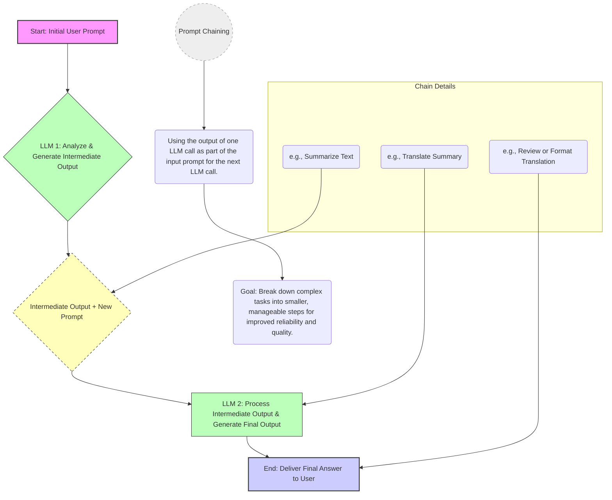

# llm_tutorial
Learning about llms

```mermaid
graph TD
    %% Define the process steps
    A[Start: Initial User Prompt] --> B{LLM 1: Analyze & Generate Intermediate Output};

    %% Step 2: The Core of Chaining
    B --> C{Intermediate Output + New Prompt};

    %% Step 3: Second LLM Call
    C --> D[LLM 2: Process Intermediate Output & Generate Final Output];

    %% Step 4: Final Result
    D --> E[End: Deliver Final Answer to User];

    %% Sub-processes/Details (Optional but adds clarity)
    subgraph Chain Details
        F(e.g., Summarize Text)
        G(e.g., Translate Summary)
        H(e.g., Review or Format Translation)
    end

    %% Connect the details to the main flow
    F --> C;
    G --> D;
    H --> E;

    %% --- STYLING DEFINITION ---
    %% Define reusable style classes for nodes
    classDef start_end_node fill:#f9f,stroke:#333,stroke-width:2px;
    classDef process_node fill:#bfb,stroke:#333;
    classDef chaining_node fill:#ffb,stroke:#333,stroke-dasharray: 5 5;
    classDef final_node fill:#ccf,stroke:#333,stroke-width:2px;
    classDef annotation fill:#eee,stroke:#999,stroke-dasharray: 5 5;

    %% Define the annotation nodes for context
    I(("Prompt Chaining")):::annotation
    J(Using the output of one LLM call as part of the input prompt for the next LLM call.);
    K(Goal: Break down complex tasks into smaller, manageable steps for improved reliability and quality.);
    I --> J;
    J --> K;


    %% --- STYLING APPLICATION (The Missing Step) ---
    %% Apply the defined styles to the specific nodes
    class A start_end_node;
    class B process_node;
    class C chaining_node;
    class D process_node;
    class E final_node;


```
